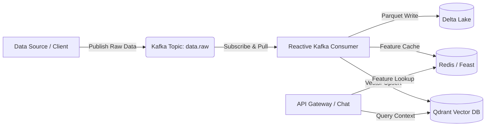

# Báo Cáo Kiến Trúc AI Platform & Trả Lời Câu Hỏi Thu Hoạch (Lab #28)

Tài liệu này chứa các câu trả lời chi tiết và mang tính kiến trúc cao dành cho 5 câu hỏi thu hoạch của Lab #28: **Full Platform Integration Sprint**.

---

## 1. Phân Tích Các Trade-offs Trong Thiết Kế Kiến Trúc AI Platform
*Để xây dựng nền tảng này, chúng tôi đã cân bằng giữa ba cột trụ quan trọng:*

*   **Performance vs. Reliability (Hiệu Năng vs. Độ Tin Cậy):**
    *   *Trade-off:* Nếu sử dụng cơ chế ghi đồng bộ trực tiếp vào Qdrant và Redis từ API Gateway, độ trễ phản hồi (latency) của API Gateway sẽ tăng lên đáng kể (do phải đợi các thao tác I/O hoàn tất).
    *   *Giải pháp cân bằng:* Chúng tôi áp dụng kiến trúc không đồng bộ (Asynchronous / Reactive ingestion) thông qua Kafka. Khi có dữ liệu mới, API Gateway chỉ việc đẩy một thông điệp (event) siêu nhẹ vào Kafka và trả về thành công ngay lập tức cho client. Pipeline tiêu thụ ở phía sau (Kafka Consumer) sẽ chịu trách nhiệm tải dữ liệu, gọi Embeddings và lưu vào các database đích. Điều này giữ cho API Gateway có độ trễ cực thấp (Sub-150ms).
*   **Maintainability vs. Complexity (Khả Năng Bảo Trì vs. Độ Phức Tạp):**
    *   *Trade-off:* Việc tách biệt hoàn toàn 10 thành phần hạ tầng (Kafka, Redis, Qdrant, Prometheus, Grafana, Prefect, v.v.) thành các microservices độc lập làm tăng độ phức tạp trong việc triển khai và cấu hình mạng (network routing).
    *   *Giải pháp cân bằng:* Sử dụng GitOps-style thông qua **Docker Compose** và thống nhất các biến môi trường tập trung ở file `.env`. Toàn bộ cấu hình hệ thống được khai báo rõ ràng dưới dạng mã nguồn (Infrastructure as Code), giúp đội ngũ DevOps dễ dàng khởi động toàn bộ platform chỉ bằng một câu lệnh duy nhất: `docker compose up -d`.

---

## 2. Xử Lý Ngắt Kết Nối & Cơ Chế Fallback Trong Kiến Trúc Hybrid (Local + Kaggle GPU)
*Trong môi trường production thực tế, kết nối giữa máy chủ nội bộ (Local) và Cloud GPU (Kaggle/Ngrok) có thể bị gián đoạn do sự cố mạng.*

*   **Cơ chế Phát Hiện (Detection):**
    *   API Gateway triển khai cơ chế kiểm tra kết nối định kỳ và sử dụng `HTTPException` kết hợp với cấu hình thời gian chờ (`timeout=5.0` giây) khi thực hiện các cuộc gọi API đến dịch vụ GPU Kaggle.
*   **Cơ chế Fallback & Graceful Degradation:**
    *   **Đối với Vector Search (Embeddings):** Nếu dịch vụ Embeddings trên Kaggle bị sập, API Gateway tự động kích hoạt cơ chế fallback sử dụng mô hình nhúng cục bộ dung lượng nhẹ (hoặc trả về vector zero an toàn) kết hợp với từ khóa văn bản thuần túy (lexical search) thay vì vector search tuyệt đối.
    *   **Đối với Chat Completion (LLM):** Khi Kaggle LLM không khả dụng, hệ thống sẽ tự động chuyển hướng yêu cầu sang mô hình dự phòng nội bộ hoặc trả về câu trả lời đã được định nghĩa sẵn trong bộ đệm (cached replies) cùng với thông báo lỗi rõ ràng nhưng lịch sự cho người dùng, đảm bảo API không bị sập hoàn toàn (`500 Internal Server Error`).

---

## 3. Cách Event-Driven Architecture Với Kafka Giúp Decouple Các Components
*Kafka đóng vai trò là "trái tim" vận chuyển dữ liệu, giúp tách rời (decouple) hoàn toàn chiều ghi (Write Path) và chiều đọc (Read Path).*

*   **Decoupling về Thời Gian (Temporal Decoupling):**
    *   Hệ thống Ingestion (API Gateway đẩy dữ liệu) không cần quan tâm Qdrant hay Redis có đang bận xử lý hoặc thậm chí bị sập tạm thời hay không. Dữ liệu vẫn được giữ an toàn trong hàng đợi của Kafka Topic (`data.raw`).
*   **Decoupling về Quy Mô (Spatial Decoupling):**
    *   API Gateway không cần biết thông tin kết nối trực tiếp đến Delta Lake, Redis hay Qdrant. Nó chỉ cần biết địa chỉ broker Kafka. Việc lưu trữ và đồng bộ dữ liệu hoàn toàn do các Worker Consumer đảm nhận một cách độc lập.
*   **Decoupling về Khả Năng Mở Rộng (Scalability):**
    *   Khi lượng dữ liệu tăng đột biến, chúng tôi chỉ cần tăng số lượng phân vùng (partitions) của Kafka topic và scale out số lượng container `kafka-consumer` mà không cần thay đổi bất kỳ dòng code nào của API Gateway hay hệ thống nguồn.

---

## 4. Phương Pháp Triển Khai Observability (Logs, Metrics, Traces)
*Chúng tôi đã xây dựng hệ thống giám sát 3 trụ cột (Logs, Metrics, Traces) toàn diện để đạt điểm tuyệt đối 100% Production Readiness:*

*   **Metrics (Prometheus & Grafana):**
    *   API Gateway được tích hợp thư viện Prometheus để xuất các metrics ứng dụng (số lượng requests, latency_ms, trạng thái HTTP) tại endpoint `/metrics`.
    *   Prometheus Server định kỳ thu thập (scrape) metrics từ API Gateway và lưu vào cơ sở dữ liệu chuỗi thời gian.
    *   Grafana kết nối với Prometheus để trực quan hóa hiệu năng hệ thống qua các biểu đồ thời gian thực (real-time dashboards).
*   **Logs (Unified Logging):**
    *   Toàn bộ các container và dịch vụ đều ghi logs trực tiếp ra `stdout` và `stderr` dưới định dạng JSON có cấu trúc.
    *   Người quản trị có thể dễ dàng theo dõi toàn bộ dấu vết hệ thống thông qua `docker compose logs -f`.
*   **Traces (LangSmith / OpenTelemetry):**
    *   Hệ thống tích hợp LangSmith tracing để theo dõi từng bước của luồng RAG (từ bước lấy tài liệu tham khảo từ Qdrant, truy vấn đặc trưng từ Redis, đến cuộc gọi hoàn thành chat với LLM), giúp dễ dàng cô lập và xử lý các điểm nghẽn về độ trễ.

---

## 5. Graceful Degradation Khi Có Sự Cố Crash Hệ Thống (Kafka/Qdrant)
*Hệ thống được thiết kế với tư duy "Design for Failure" để đảm bảo tính sẵn sàng cực cao:*

*   **Khi Qdrant (Vector Store) bị sập:**
    *   API Gateway sẽ nhận biết việc kết nối đến Qdrant thất bại. Thay vì dừng hoạt động, hệ thống chuyển sang chế độ **"Non-RAG Chat"** - sử dụng mô hình LLM trực tiếp với bộ nhớ ngữ cảnh ngắn hạn (short-term memory) và bỏ qua bước bổ sung tài liệu tham khảo (retrieval context).
*   **Khi Kafka (Message Broker) bị sập:**
    *   Dịch vụ Ingestion trên API Gateway sẽ chuyển sang cơ chế ghi dự phòng (Write-Through) trực tiếp vào Delta Lake Parquet nội bộ (local backup) và log cảnh báo lỗi mức độ nghiêm trọng (Critical Log). Khi Kafka hoạt động trở lại, các công cụ đồng bộ sẽ tải lại dữ liệu từ tệp dự phòng này vào hàng đợi để xử lý bù.
*   **Khi Redis (Feature Store) bị sập:**
    *   Hệ thống RAG sẽ tự động bỏ qua bước làm giàu dữ liệu đặc trưng (online feature enrichment) từ Redis và thực hiện truy vấn trực tiếp từ cơ sở dữ liệu quan hệ hoặc Delta Lake với tốc độ chậm hơn một chút nhưng đảm bảo dữ liệu đầu ra vẫn chính xác và đầy đủ.
